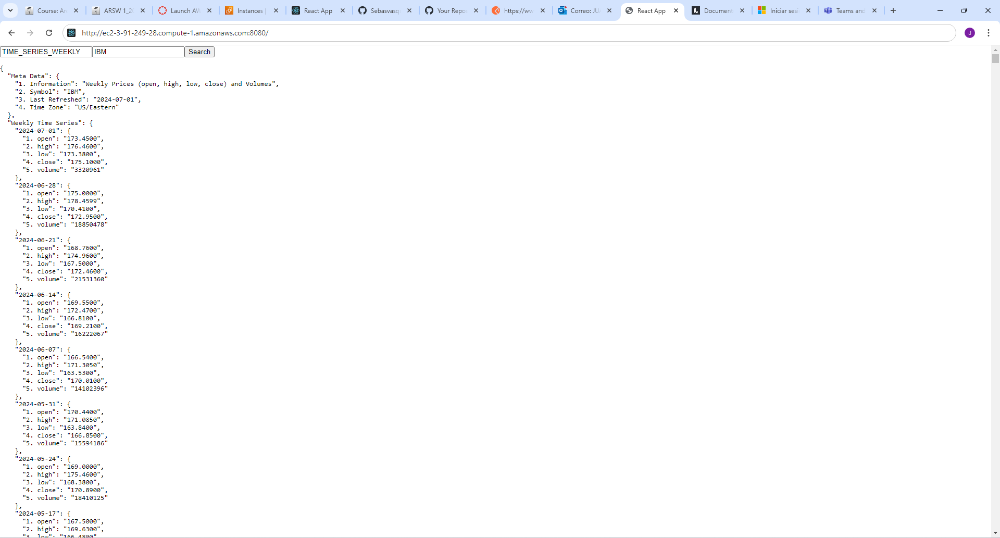

# Parcial

Este proyecto contiene una aplicación para consultar el mercado de valores de las acciones negociadas en Bolsa.  La aplicación recibe el identificador de una acción, por ejemplo “MSFT” para Microsoft  y deberá mostrar el histórico de la valoración intra-día, diaria, semanal y mensual. Para esto se utiliza el API gratuito de https://www.alphavantage.co/documentation. 

### Features
1. Cliente escrito en React invocando servicios REST 
2. Servidor fachada implementado en Spring exponiendo servicios REST 
3. Conexión a servicios externos
4. Aplicación desplegada en AWS 
5. Cliente Java para Tests concurrentes 
6. Cache tolerante a la concurrencia 

## Getting Started
Download the project from 
[the repository.](https://github.com/Sebasvasquezz/Parcial1)

You can also clone the file using the following command.

```
git clone https://github.com/Sebasvasquezz/Parcial1  
```

### Prerequisites

* [Maven](https://maven.apache.org/): Automate and standardize the life flow of software construction

* [Git](https://www.git-scm.com/): Decentralized Configuration Manager

* [Node](https://nodejs.org/en/): A JavaScript runtime built on Chrome's V8 engine, enabling server-side scripting and development of scalable network applications.

### Installing
1. Maven
    * Download Maven in http://maven.apache.org/download.html
    * You need to have Java installed (7 or 8)
    * Follow the instructions in http://maven.apache.org/download.html#Installation

2. Git
    * Download git in https://git-scm.com/download/win
    * Follow the instructions in https://git-scm.com/book/en/v2/Getting-Started-Installing-Git

3. Node
    * Download Node in https://nodejs.org/en
    * Follow the instructions in https://nodejs.org/en/learn/getting-started/how-to-install-nodejs

### Installing

Once you have the cloned project in your repository. Follow the steps below to launch the program successfully.

#### Run BackEnd Spring-boot

1. Open a terminal and enter the folder where I clone the repository and enter the BoardSpring folder.

2. Use the following command to removes files generated in previous builds, compiles the code and packages the project into a JAR or WAR file ready for distribution.
    ```
    mvn clean package
    ```
3. Now you can run the project using the following command.

    ```
    mvn spring-boot:run
    ```

4. Now open a browser and go to the following [link](http://ec2-3-91-249-28.compute-1.amazonaws.com:8080/) to start drawing:



## Architectural Design


### Data Flow

#### Initialization:

- App mounts ActionFetcher and Canvas.
- ActionFetcher starts making GET requests to the server every second to update actions.

#### Drawing:

- When the user clicks on the canvas, Canvas creates a drawing action and sends it to the server via a POST request.
- drawAction in Canvas immediately draws the action.

#### Update:

- ActionFetcher periodically fetches actions from the server and updates the actions state in App.
- Whenever actions updates, Canvas clears and redraws all actions on the canvas.

## Built with

* [Maven](https://maven.apache.org/) - Dependency management
* [Node](https://nodejs.org/en/) - JavaScript runtime for building scalable network applications.

## Authors

* **Juan Sebastian Vasquez Vega**  - [Sebasvasquezz](https://github.com/Sebasvasquezz)

## Date

Jule 2, 2024

## License

This project is licensed under the GNU License - see the [LICENSE.txt](LICENSE.txt) file for details.